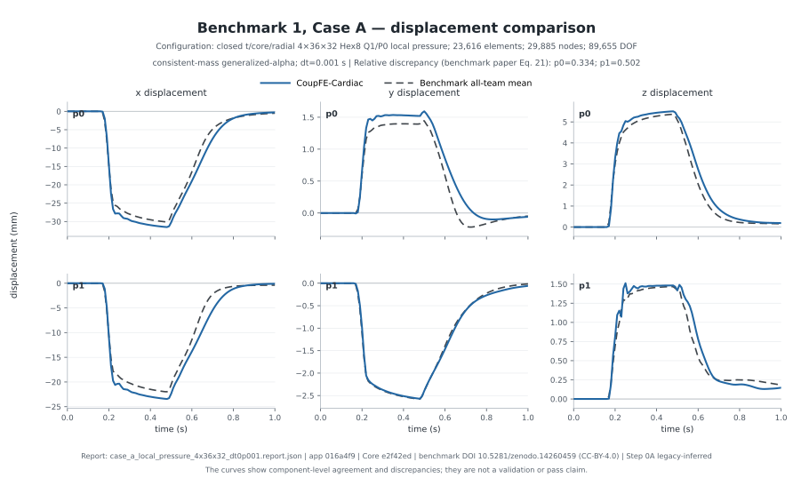
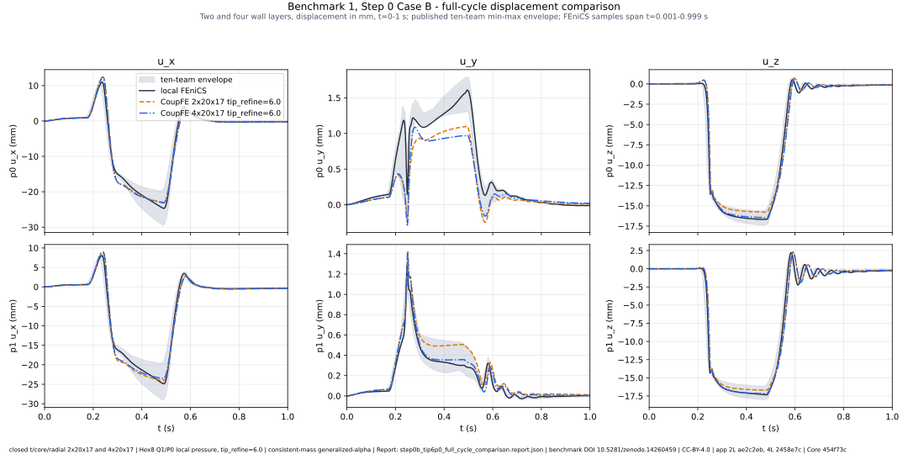

# CoupFE-Cardiac

CoupFE-Cardiac is an implementation and reproduction study of Benchmark 1 from
Reidmen Aróstica et al., [“A software benchmark for cardiac
elastodynamics”](https://doi.org/10.1016/j.cma.2024.117485), built on
[CoupFE](https://github.com/tengzhang48/CoupFE). Step 0 Case A models active
ventricular contraction with active tension and no cavity pressure, Step 0
Case B models passive deformation under time-dependent cavity pressure, and
Step 2 Case B combines active stress and ventricular pressure with the Step 2
material parameters. All cases use epicardial Robin support and compare
displacement histories at the paper's material points `p0` and `p1`.

## Reproduction status

**Verdict:** the current Step 0B `p0`/`p1` displacement histories are
partially reproduced; the whole paper benchmark is not. The clean closed
Step 0B run captures the snap-through and recovery with close event timing;
its canonical-grid relative L2 against the exact ten-team mean is
8.98%/9.20% at `p0`/`p1`. See the answer-first
[benchmark reproduction status](docs/BENCHMARK_REPRODUCTION_STATUS.md) for
the metrics and claim boundary.

## Case A — active contraction



*Case A — the selected fine closed-multiblock CoupFE result against the
benchmark all-team mean at `p0`/`p1`, all three components. The run
predates the straight-wall and physical-frame corrections; its Step 0A
identity is labeled `legacy-inferred`. Benchmark-paper Eq. 21 RED is
0.3337 at `p0` and 0.5025 at `p1` — above most teams' values (0.17-0.30
and 0.20-0.38, with Simula the higher outlier at ~1.5), so this retained
result is a relatively high-RED participant, not a near-mean one. Details:
[Case A status](docs/CASE_A_STATUS.md).*

## Step 0 Case B — passive pressure loading

**Current Step 0B result (2026-08-07).** The closed `2x20x17` and `4x20x17`,
`tip_refine=6.0` runs completed 1,000/1,000 increments on eight MPI ranks
with the current generalized-alpha Q1/P0 local-pressure path. Against the
local FEniCS record, full-shared-history RMSE is 1.0169/1.0730 mm
(`p0`/`p1`, four layers) with snap-window maximum gaps 4.19/3.75 mm; the
two-layer comparison, provenance hashes, and the isolated replay check are
recorded in the source-bound
[comparison report](examples/cardiac_benchmark/results/step0b_tip6p0_full_cycle_comparison.report.json).
Agreement is component-specific, not uniform: the axial component stays
inside the ten-team envelope for ~85% of the cycle, but the y component
sits below the team band through the peak (~0.2-0.6 mm low at 0.44 s) and
briefly flips sign for ~40 ms during unloading, and z leaves the band in
parts of unloading. The remaining discrepancies concentrate in the snap
window and the unloading/rebound phase. This is sensitivity evidence near
snap-through, not a convergence or validation claim. Read the
[mesh refinement guide](docs/MESH_REFINEMENT_GUIDE.md) before interpreting
any mesh label; the runtime and command template for controlled runs are in
[controlled benchmark runs](docs/CONTROLLED_BENCHMARK_RUNS.md).



*Step 0 Case B — full cycle at `p0`/`p1`, all three components: CoupFE
`tip_refine=6.0` configurations against the local FEniCS record and the
published ten-team envelope.*

## Step 2 Case B — active stress plus ventricular pressure

Step 2 Case B is implemented, but this alpha release makes no Step 2
reproduction claim. The fully source-bound retained development run used the
earlier geometry/frame implementation and showed an opposite-sign `p1-z`
plateau. A later corrected-setup Q1/P0 run produced a promising trajectory, but
its compact public comparison record does not yet bind the complete source,
execution, solver, deformation, and ten-team input provenance required for
release-grade evidence. It is retained as a provenance-incomplete diagnostic,
not headline benchmark evidence; see the [Step 2 Case B reproduction
log](docs/STEP2_CASE_B_REPRODUCTION_LOG.md).

The archived open-tip (truncated-polar) Step 0 Case B figure and reports
are historical records from a non-benchmark geometry, retained for lessons
only; see the [archive note](docs/figures/archive/truncated_polar/README.md)
and the [result index](examples/cardiac_benchmark/results/README.md).

## Install and check

Clone this source application before installing it. The compiled check needs
a Fortran compiler. PETSc checks additionally need a mutually compatible
PETSc, MPI, `petsc4py`, and `mpi4py` installation.

```bash
python -m pip install -e ".[dev]"
python -m pytest -q
```

Optional checks are explicit:

```bash
python -m pytest -q -m slow       # compile and run the reduced serial case
python -m pip install -e ".[dev,mpi]"
python -m pytest -q -m mpi        # PETSc callback and 1/2/4-rank checks
```

The CoupFE dependency is an exact Git commit and cannot fall through to an
unrelated package-index project. To test an intentional local Core change,
install that checkout first, install this repository with `--no-deps`, and
record both Git revisions and tree states with the result. Current checks pin
Core `e2f42ed5772850a0a23a2ce434f430c287eae5c8`; older retained records
identify historical Core `454f73ce2de284262b214a2b37bd676c6aca3c0a` and are
intentionally not relabeled.

This is a source-application repository: executable drivers live under
`examples/`. Its wheel intentionally contains metadata and legal notices only.

## Code

Cardiac mesh and facet semantics, fiber attachment, boundary operators,
benchmark parameters, output sampling, and comparison policy stay in this
repository. CoupFE supplies generic code generation, compiled-element
runtime, operator composition, serial assembly, and PETSc/MPI
infrastructure. The exact public Core revision is pinned in
`pyproject.toml`. Executable options, result fields, and application-owned
helpers are summarized in the [application interface reference](docs/API.md).

The benchmark application provides three volumetric choices (`fbar`,
`std-kappa`, and the application-owned condensed Q1/P0 mean-`log(J)`
`local-pressure`), two nonlinear solvers (`core-newton`, `petsc-snes`), and
an MPI companion (`run_mpi.py`) with a fail-closed closed-domain contract.
Formulation semantics and solver acceptance rules are documented in
[docs/API.md](docs/API.md) and the
[case specifications](docs/CASE_SPECIFICATIONS.md).

## Running the benchmark

The controlled-run command template, the pinned runtime, the Laplace-field
workflow, acceptance gates, and the observed failure modes are in
[docs/CONTROLLED_BENCHMARK_RUNS.md](docs/CONTROLLED_BENCHMARK_RUNS.md).
Mesh axes and the tip-grading control are documented in the
[mesh refinement guide](docs/MESH_REFINEMENT_GUIDE.md). The serial example
commands live in [examples/cardiac_benchmark/README.md](examples/cardiac_benchmark/README.md).

## Result records

[`examples/cardiac_benchmark/results/`](examples/cardiac_benchmark/results/)
indexes every retained result: the current Step 0B full-cycle comparison,
the 0.32 s prefix diagnostic, the selected fine Case A report, the Step 2
Case B development record, and the archived truncated-polar records with
their complete tables, RED values, per-run narratives, and provenance
hashes. Generated NPZ archives and external CC BY 4.0 pickles are not
committed; the reports bind them by content hash.

## External benchmark data

Reference curves are not vendored. Download `benchmark_article_data.zip`
from the 23.2 GB, CC BY 4.0 [Zenodo
dataset](https://doi.org/10.5281/zenodo.14260459), verify its published size
and checksum, and supply the extracted directory explicitly:

```bash
export CARDIAC_BENCHMARK_DATA_DIR=/path/to/extracted/archive
python examples/cardiac_benchmark/post.py \
  caseB_local_pressure.npz --case step_0B --plot caseB.png
```

Only load pickle files from the trusted Zenodo archive. RED is a reported
measurement; this repository does not assign it an automatic validation
threshold. See the [benchmark data and comparison
guide](docs/BENCHMARK_COMPARISON.md) and [example reference
map](examples/REFERENCES.md).

## Limitations

- The historical polar-ring choice (`--apex-offset 0.2`) truncates 1.9335 mm
  from the tip and adds a traction-free annular boundary; those retained
  runs are not the paper's closed domain. The closed five-block mesh passes
  the pre-solve geometry and boundary checks, but one completed mesh is not
  spatial convergence, rank equivalence, or validation.
- The application-owned Q1/P0 operator differs from the paper's pointwise
  volumetric law and from the P2-tetrahedron reference discretization;
  formal spatial and time convergence are absent.
- A nonpositive or non-finite trial `det(F)` is never accepted; the
  recovery path is a robustness mechanism, not evidence that a severely
  distorted mesh is accurate.
- The locally retained FEniCS point-stress arrays are quarantined as a
  quantitative oracle (postprocessor state omissions and a dimensionally
  inconsistent von Mises expression); they are not evidence the solve is
  wrong.
- Fiber handedness, conventions, mesh resolution, apex treatment, and
  output-point interpolation can all affect signed Case B displacement and
  twist; a sign change between runs is not by itself a bifurcation.
- No result here is clinical validation, medical-device qualification, or a
  substitute for real-device or patient-specific validation.

## Repository map

- `examples/cardiac_benchmark/`: serial model, formulations, solvers, MPI
  companion, diagnostics, retained outputs, and guarded comparison
  utilities.
- `examples/mpi_smoke/`: opt-in distributed implementation checks.
- `examples/REFERENCES.md`: scientific sources and reproducibility
  boundaries.
- `tests/`: fast, compiled-serial, PETSc, and MPI checks, organized by the
  [benchmark test matrix](docs/BENCHMARK_TEST_MATRIX.md).
- `docs/`: status and evidence records, guides, release checks, and design
  lessons.
- `CONTRIBUTING.md`: application/Core ownership and contribution checks.

AI agents assisted with implementation review, test development, and public
documentation. Numerical statements remain tied to the checked-in code,
tests, cited sources, and retained result records; agent discussion by
itself is not numerical evidence.

Repository-authored code is Apache-2.0; repository-authored documentation
and text/JSON evidence records are CC BY 4.0. Comparison report JSON also
contains transformed all-team means, standard deviations, minimum/maximum
envelopes, selected Simula curves, and comparison values from the cited
CC BY 4.0 Zenodo dataset; these are identified modifications, while the raw
archive and team pickles are not redistributed. `activation.py` is a
CC-BY-4.0 adaptation of the exact Finsberg/Sundnes/van den Brink Zenodo
v1.0.0 deposit. `fiber_crosscheck.py` and `structural_directions.py` are
MIT-licensed adaptations.
`THIRD_PARTY_NOTICES.md` and `LICENSES/` identify their exact boundaries,
immutable sources, license-record details, standard terms, and upstream
credit. The paper and Zenodo dataset are cited; their raw archive and
pickle files are not redistributed.
