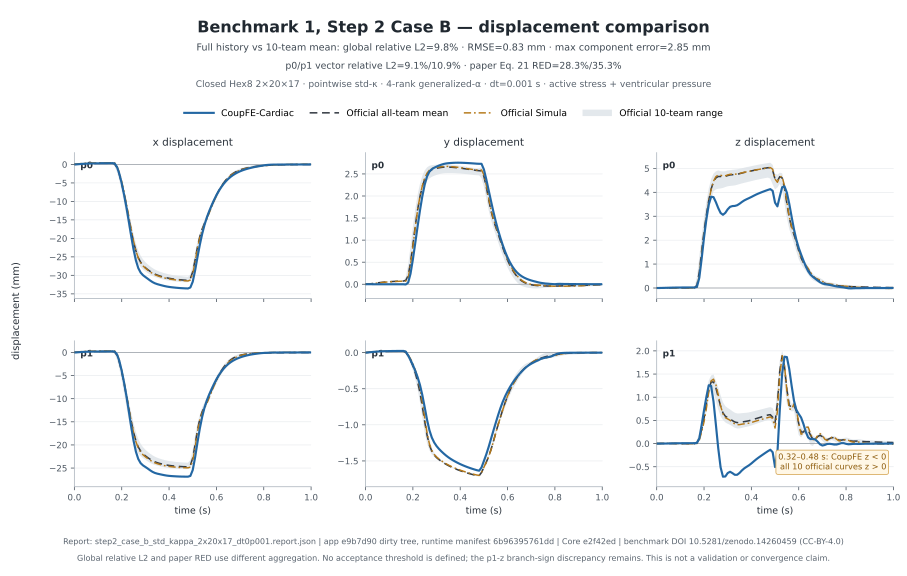

# Benchmark data and numerical comparison

This guide explains which parts of Cardiac Benchmark 1 are implemented, what
the automated tests check, what result records are retained, and how to compare
a new run with the separately distributed reference curves. A model citation
and a successful solve are necessary context, but neither alone establishes
whole-case numerical agreement.

## Benchmark and external data

The application follows parts of Benchmark 1 in Aróstica et al., *A software
benchmark for cardiac elastodynamics*, *Computer Methods in Applied Mechanics
and Engineering* **435** (2025), 117485,
<https://doi.org/10.1016/j.cma.2024.117485>.

The benchmark reports displacement histories at material points `p0` and `p1`.
`post.py` resamples a completed CoupFE-Cardiac history onto the reference time
grid and calculates the paper's relative discrepancy (RED) against the
all-team mean. It reports the participating-team range but does not assign a
pass/fail threshold. Step 2 Case B instead uses the hash-pinned
`compare_step2b_case_b.py` publisher comparator and the distinct renderer
documented below. The separate [local FEniCS comparison
protocol](CASE_B_FENICS_COMPARISON.md) compares the same landmarks directly
with the retained P2-tetrahedron output using fixed RMSE, relative-L2, and
snap-onset definitions and a complete five-input hash gate.

## Paper benchmark comparison figures

The Case A figure in this section renders the selected fine closed-multiblock
result. The checked-in Step 0 Case B figure renders the current tip-refined,
closed-multiblock full-cycle comparison. Historical open-tip figures are kept
only under the explicitly labeled archive. The closed Step 2 figure is
identified separately.


*Case A: selected fine CoupFE-Cardiac closed 4×36×32 Hex8 Q1/P0 local
pressure, consistent mass, source-matched generalized-alpha, `dt=0.001 s`,
from the compact
[`016a4f9` report](../examples/cardiac_benchmark/results/case_a_local_pressure_4x36x32_dt0p001.report.json).
Solid blue is CoupFE-Cardiac; dashed charcoal is the benchmark all-team mean.
The producing source predates the toolkit-matched straight-wall mapping and
physical-coordinate structural-frame reconstruction.*

The compact report retains the exact external NPZ, campaign manifest and
stdout identities, clean application/Core revisions, closed-mesh and method
configuration, physical-point sampling metadata, ten-team reference manifest,
101-point curves, and RED. Its Step 0A identity is labeled `legacy-inferred`
because the archive predates the explicit benchmark-identity fields; the
inference is bounded to its recorded Case A label, source-identified closed
Case A path, active tension, and all-zero pressure history.

The archived open-tip eight-element F-bar reports at
[`6839c13`](../examples/cardiac_benchmark/results/archive/truncated_polar/case_a/case_a_fbar_1x2x4_dt0p002_corrected_switch.report.json)
and [`62ad760`](../examples/cardiac_benchmark/results/archive/truncated_polar/case_a/case_a_fbar_1x2x4_dt0p002.report.json)
remain public and unchanged as exact-configuration regression and
historical-law records, not current validation evidence. The
[Case A stopping record](CASE_A_STATUS.md) gives the selected trajectory's
Simula comparison, mesh evidence, and claim boundary.

The Step 0 Case B comparison evidence is the current closed-geometry
[full-cycle result](../examples/cardiac_benchmark/results/step0b_tip6p0_full_cycle_comparison.report.json)
and the separate
[`0.32 s clean prefix diagnostic`](../examples/cardiac_benchmark/results/step0b_case_b_clean_frame_0p32.report.json).


*Step 0 Case B: closed 2×20×17 and 4×20×17 Q1/P0 local-pressure runs with
tip-refinement strength 6.0, consistent mass, source-matched
generalized-alpha, `dt=0.001 s`, and eight MPI ranks. The comparison report
binds both external run archives and the exact FEniCS and ten-team inputs. It
is controlled full-cycle evidence, not a mesh-convergence or exact-reproduction
claim.*

The **archived open-tip `truncated_polar` Case B figure and reports are
deliberately not shown here.** That campaign used a cut apex carrying a fourth
traction-free surface, lumped mass in several records, and backward Euler at
`dt = 2e-3` s — a different domain, boundary set, mass representation and
integrator, so placing it beside the current curves would invite a comparison
that is not one-variable. It is retained for method comparison and lessons only,
under [`results/archive/truncated_polar/`](../examples/cardiac_benchmark/results/archive/truncated_polar/)
and [`docs/figures/archive/truncated_polar/`](figures/archive/truncated_polar/).
What differs, case by case, is tabulated in
[`CASE_SPECIFICATIONS.md`](CASE_SPECIFICATIONS.md).



*Step 2 Case B: four-rank pointwise-`kappa` 2×20×17 closed Hex8,
source-matched generalized-alpha, `dt=0.001 s`, active stress plus ventricular
pressure, from the
[`e9b7d90` development report](../examples/cardiac_benchmark/results/step2_case_b_std_kappa_2x20x17_dt0p001.report.json).
The six panels show CoupFE-Cardiac, the official ten-team range and mean, and
the named Simula curve. The [raw stdout](../examples/cardiac_benchmark/results/step2_case_b_std_kappa_2x20x17_dt0p001.raw.stdout.txt)
is retained separately. The producing content predates the straight-wall and
physical-coordinate-frame corrections.*

The Step 2 run completed all 1,000/1,000 increments. Against the official
all-team mean over the full 101-point cycle, global relative L2 is 9.8038%,
the `p0`/`p1` vector relative L2 values are 9.0555%/10.9271%, aggregate RMSE
is 0.829875 mm, and maximum component error is 2.846225 mm. The benchmark
paper Eq. 21 RED values are 28.3004%/35.2774%. RED is the time average of the
pointwise relative vector error; the reported relative L2 divides accumulated
full-history norms. These are different aggregations, and the paper supplies
no acceptance threshold for either. The `p1-z` plateau has the wrong sign
relative to all ten published trajectories.

The Step 2 figure is development evidence. Its archive reports application
`e9b7d90` with a dirty tree, while the exact result-producing contents are
bound by runtime-source hash
`6b96395761dd3203f0e9ffab90a77d6389dca13cdad43490a1deac95073480f1`;
Core is `e2f42ed`. None of the three figures is a mesh/time-convergence or
clinical-validation claim. The reference curves are derived from the CC BY
4.0 dataset identified below.

A later corrected-setup Q1/P0 Step 2 trajectory is retained separately as a
provenance-incomplete diagnostic. It is intentionally excluded from this
release-grade comparison because its compact record does not bind the complete
source, execution, solver/deformation, and exact ten-team role/hash inputs.

The raw comparison inputs remain external:

- Zenodo DOI: <https://doi.org/10.5281/zenodo.14260459>
- license: CC BY 4.0
- file: `benchmark_article_data.zip`
- published size: 23,180,741,494 bytes
- Zenodo checksum: `md5:75602be4777c4ca2262c2bcfd2134b15`
- independently computed SHA-256:
  `134951af5e38d147b0223f0a83666eb3fe1b75acb5bfa9f1b9aa30f255f8f1f5`

The archive and team pickle files are not vendored. Download them from Zenodo,
verify the archive identity, and load pickle files only from that trusted copy.
Archived retained JSON reports identify every input file and include the derived
all-team mean curves and RED values needed to inspect the comparison. Those
derived records retain the dataset's CC BY 4.0 attribution; they are not a
redistribution of the source pickle files.

## Code and automated checks

| Area | Available code | What the tests establish |
|---|---|---|
| Geometry and fibers | historical polar-ring and five-block closed Hex8 ventricular meshes, boundary-facet ownership, analytic fiber/sheet/normal frames, and Gauss-point sampling policies | the closed mesh passes extended Jacobian, exactly-one exterior-label, reference-measure, signed pressure-resultant/moment, and Robin pre-solve gates; a completed development trajectory is assessed separately below |
| Material and loads | Holzapfel–Ogden passive response, active tension, viscous history, Robin support, and follower pressure | material and boundary reactions, orientations, scalar/batched equality, and selected analytic or finite-difference tangents |
| F-bar formulation | historical single-displacement-field compiled Hex8 path | compiled component and reduced-run behavior at stated configurations; not a spatially converged ventricular oracle |
| Q1/P0 local-pressure variants | standard Q1 material kernel with bulk penalty disabled plus one algebraically eliminated P0 pressure per Hex8, using either the named log-law or paper-law scalar response | affine log-law `p=K log(J)` and paper-law `p=K*(J**2-1)/2` responses, isochoric response, tangent symmetry and finite differences, invalid-cell controls, and a determinant-valid Core step bound |
| Output sampling | checked inverse reference Hex8 map and eight-node isoparametric interpolation | exact affine interpolation, actual `p0`/`p1` location on tested meshes, deterministic shared-boundary selection, and rejection of outside or degenerate candidates |
| Nonlinear solve | guarded Core Newton and optional persistent PETSc SNES | Core bounds Q1/P0 corrections; PETSc backtracks only dedicated invalid-deformation residual trials and records them; invalid accepted states and false convergence are rejected before state commit; real PETSc callbacks and context reuse are checked in the opt-in PETSc environment |
| Result writing and comparison | atomic completed-result archives, external RED utility, and guarded direct FEniCS landmark comparison | partial/non-finite/mismatched results, incomplete expected-hash manifests, legacy material-law identities, and unqualified source identities are rejected by their stated contracts |
| Distributed scripts and companion | five open-apex PETSc/MPI examples plus distinct historical-Q1/P0 and closed-Case-B companion contracts | exact historical script/rank comparisons and focused closed/std-`kappa`/consistent-mass integration checks; a retained same-configuration cross-snap rank gate is required before making rank-equivalence or scaling claims |

These checks are deliberately local or configuration-specific. They make
errors easier to find and results easier to audit; they do not replace a mesh
and time study against the external curves.

The invalid-trial recovery changes no nonlinear tolerance: Core uses the
operator's `max_step` hook, while PETSc maps only `InvalidDeformationError` in
the residual callback to IEEE positive infinity for `bt`. Jacobian and
unrelated residual errors abort, and no invalid accepted/final state is
committed.

## Discretization recorded by result archives

Result archives distinguish the choices that can materially change the
reported curves:

- `formulation=hex8_fbar` for F-bar, or
  `hex8_local_pressure_p0_condensed_logj` for the application-owned Q1/P0 path;
- `mesh_topology` and its topology-specific construction parameters;
- CG1/Gram–Schmidt or direct Gauss-point fiber sampling, plus the analytic or
  injected Laplace transmural coordinate;
- `point_sampling=hex8_reference_isoparametric`, including the selected
  element, natural coordinates, eight weights, and reconstruction error for
  `p0` and `p1`;
- backward Euler or the optional Newmark path;
- guarded Core Newton or PETSc SNES, with configuration and accepted-step
  diagnostics; and
- mesh resolution, apex offset, perturbation, material and Robin parameters,
  and exact source identity.

For all three volumetric paths the driver retains peak-load Gauss-point `det(F)`.
For Q1/P0 it also retains the eliminated element pressure at peak load. These
are useful validity and sensitivity diagnostics, not independent agreement
metrics.

## Retained Case A executions

[`examples/cardiac_benchmark/results/`](../examples/cardiac_benchmark/results/)
preserves the compact selected fine comparison. The fine closed 4×36×32 Q1/P0
result identifies clean application/Core checkpoints
`016a4f9`/`e2f42ed`, uses consistent-mass generalized-alpha at `dt=0.001 s`,
and completed 1,000/1,000 steps on eight ranks. Its RED against the ten-team
mean is 0.3337402/0.5024615 at `p0`/`p1`. RED is the paper's time average of
pointwise relative vector error; it is not the 8.56568%/12.26311%
full-history relative L2 reported separately against named Simula.
This retained run predates the toolkit-matched straight-wall mapping and
physical-coordinate structural-frame reconstruction and remains bound to that
recorded source.

The compact report is derived evidence rather than a replacement for the
external 16,232,720-byte NPZ. It binds that archive by SHA-256
`ba9b31ec533398be1f39fc9a898e72f77d9587c90f9b7d9e00ce91e4d2ae6a6c`
and labels its Step 0A identity `legacy-inferred` because the old archive does
not record the later explicit benchmark fields.

The archived
[`case_a/`](../examples/cardiac_benchmark/results/archive/truncated_polar/case_a/)
directory preserves the earlier reduced Case A history and two source-identified
500-step reruns. The historical-law rerun identifies clean application/Core
checkpoints `62ad760`/`454f73`; the checked-in corrected-law regression oracle
identifies `6839c13`/`e2f42ed`. Both reruns use eight open-apex Hex8 elements,
`dt=0.002 s`, backward Euler, and the reference Hex8 isoparametric sampler.
They are exact-configuration regression/history records from non-benchmark
geometry, not current validation evidence.

The historical-law report has RED 0.5218981/0.6816066 at `p0`/`p1`. The
corrected-law report differentiates the complete smooth-switch energy and has
RED 0.5061198/0.6790790. Each report retains the verified `step_0A`
comparison, full histories, source identities, peak Gauss-point deformation
summary, and all accepted-step records; the older report remains labeled and
is not used as the corrected-law oracle. These values have no repository pass
threshold, and neither eight-element result is a mesh/time study or full
paper-curve validation.

## Case B records

The [Step 0 Case B implementation and result record](CASE_B_STATUS.md) and the
distinct [Step 2 Case B reproduction log](STEP2_CASE_B_REPRODUCTION_LOG.md)
separate three different bodies of work:

1. A 2026-06-27 development campaign used the F-bar path and a temporary PETSc
   adapter. A surviving development record lists completed observations across
   several meshes, but the raw NPZ archives and logs are absent. Those numbers
   are preserved as legacy-reported history, not independently rechecked
   current-source results.
2. Archived source-identified Q1/P0 and F-bar runs retain the Hex8 sampler, all-step
   solver diagnostics, positive peak-load deformation checks, result/log
   hashes, and verified `step_0B` comparisons. The records preserve the
   application checkpoint that produced each run.
3. The dedicated Step 2 log covers the active-stress-plus-pressure campaign on
   the closed multiblock mesh with source-matched generalized-alpha; it is kept
   separate from the Step 0 pressure-only rows.

Archived truncated-polar Step 0 Case B summary:

| App | Formulation | Mesh, `dt` | Accepted steps | Peak `p0` (mm) | Peak Gauss-point `det(F)` | RED (`p0`, `p1`) |
|---|---|---|---:|---|---|---|
| `62ad760` | Q1/P0 local pressure | 2×12×16, 0.004 s | 250/250 | (+17.917, -0.405, -0.601) | 0.894270–1.058401 | 0.8831859, 0.8657258 |
| `62ad760` | Q1/P0 local pressure | 2×12×16, 0.002 s | 500/500 | (+17.923, -0.406, -0.602) | 0.894372–1.058326 | 0.8853305, 0.8699802 |
| `62ad760` | Q1/P0 local pressure | 2×24×32, 0.002 s | 500/500 | (-7.886, +2.269, +12.725) | 0.739792–1.197484 | 1.0742661, 1.1626890 |
| `e07993b` | Q1/P0 local pressure | 2×24×32, 0.004 s | 250/250 | (-7.700, +2.261, +12.715) | 0.741052–1.196233 | 1.0741823, 1.1607469 |
| `e07993b` | Q1/P0 local pressure | 2×36×48, 0.002 s | 500/500 | (-36.229, +2.037, -14.009) | 0.523357–1.475752 | 0.5511448, 0.6538962 |
| `62ad760` | F-bar | 2×24×32, 0.002 s | 500/500 | (-12.230, +2.689, +13.088) | 0.699566–1.185359 | 1.0709970, 1.2200494 |
| `62ad760` | F-bar | 2×36×48, 0.002 s | 500/500 | (-36.956, +1.415, -14.022) | 0.589525–1.316852 | 0.5953528, 0.6971874 |

This separation preserves the development history without making the old table
carry provenance it does not have. The two checkpoint-`62ad760` 2×24×32,
`dt=0.002 s` rows hold mesh, time step, geometry, sampler, source, and solver
fixed while changing the volumetric formulation. They provide a controlled
output comparison at one discretization, not an accuracy ranking or mesh/time
convergence result. The 2×12×16 Q1/P0 pair isolates a factor-of-two time-step
change on nested loading grids and shows maximum history differences of
0.144513 mm at `p0` and 0.115627 mm at `p1`. That is bounded two-step
sensitivity, not time convergence. The archived F-bar 2×24×32 and 2×36×48
histories differ by as much as 50.677 mm at `p0` and 48.298 mm at `p1`, which
makes spatial sensitivity clear without establishing a converged mesh
sequence.

All rows in the table use `apex_offset=0.2` and therefore describe the
historical truncated domain. They remain useful source-identified
configuration comparisons and regression evidence, but they are not current
validation evidence or closed-domain executions of the paper setup. The
closed-multiblock implementation has passed its pre-solve geometry and boundary
audit and produced the two historical full-cycle development records described
below. The current clean 0.32 s Step 0B prefix diagnostic is bound separately
above. Neither historical full-cycle record is inserted into this Step 0
clean-source table; the Step 2 result also has a different
active-stress-plus-pressure contract.

### Step 2 Case B full-cycle development comparison

The pointwise-`kappa` 2×20×17 closed-Hex8 run completed 1,000/1,000
generalized-alpha increments at `dt=0.001 s` on four MPI ranks. Its physical
contract is Benchmark 1 Step 2 Case B: active stress plus ventricular pressure,
consistent mass, an injected Laplace transmural field, GP-direct fibers, and
the paper material parameters. The source-identified
[`comparison report`](../examples/cardiac_benchmark/results/step2_case_b_std_kappa_2x20x17_dt0p001.report.json)
and [`raw stdout`](../examples/cardiac_benchmark/results/step2_case_b_std_kappa_2x20x17_dt0p001.raw.stdout.txt)
retain the full-cycle evidence.
Its producing content predates the straight-wall and physical-coordinate-frame
corrections, so this is historical development evidence for that recorded
implementation rather than a current-geometry trajectory.

Against the official ten-team mean, the full-history aggregate relative L2 is
9.8038%, aggregate RMSE is 0.829875 mm, and maximum component error is
2.846225 mm. Vector relative L2 is 9.0555% at `p0` and 10.9271% at `p1`.
Paper Eq. 21 RED is instead 28.3004%/35.2774%; it averages the pointwise
relative vector error over time rather than taking a ratio of accumulated
history norms. The different percentages are therefore expected and are not
alternative pass/fail scores. The paper defines no acceptance threshold. The
settled `p1-z` plateau has the opposite sign from every official team curve,
which remains a material branch discrepancy despite the bounded global norms.

The archive identifies application `e9b7d90` as dirty and Core `e2f42ed`.
It is content-identified rather than described as clean: the canonical runtime
source manifest has aggregate SHA-256
`6b96395761dd3203f0e9ffab90a77d6389dca13cdad43490a1deac95073480f1`.
This is development evidence, not validation, convergence, or a
rank-independence claim. Regenerate the reviewed figure from its checked-in
report with:

```bash
python examples/cardiac_benchmark/plot_step2b_case_b.py --canonical
```

The dated [Step 2 reproduction log](STEP2_CASE_B_REPRODUCTION_LOG.md) retains
the preceding input audit, cross-snap prefix, full-cycle decision trail, and
the explicit boundary between passed plumbing checks and numerical agreement.

### Historical pre-correction Step 0 closed-domain development comparison

The then-current 2×20×17 closed mesh completed 1,000/1,000 Step 0 Case B
increments at `dt=0.001 s` with the paper physical parameters, consistent mass,
a checked Laplace transmural field, GP-direct fibers, backward Euler, and PETSc
SNES. It predates the straight-wall and physical-coordinate-frame corrections.
All stored step diagnostics converged with zero function-domain rejections;
peak-state Gauss-point `det(F)` is 0.660073--1.152459.

Compared with the local FEniCS result on its native 1 ms grid,
full-shared-history
vector RMSE is 1.5803/1.7903 mm at `p0`/`p1`, relative L2 is
0.1176/0.1299, and the `u_z=-5 mm` onset is 5.3/5.6 ms early. Compared with
the exact ten-team mean on the canonical 10 ms grid, vector RMSE is
1.4835/1.7621 mm. The dominant x/z curves capture the qualitative snap shape
in this development comparison, while transverse y and parts of unloading
remain outside the team spread; component-wise team-envelope coverage is
31.35%/40.59%.

This comparison is `DEVELOPMENT ONLY`: application revision `6839c13` had a
dirty tree while the closed-mesh code and reporting gates were being reviewed.
It cannot be relabeled or inserted into the retained table. The completed NPZ,
comparison JSON, and displacement PNG have SHA-256
`96e28ea247503a94ee95a2513be32628934f3b201f88ebc51907f99a4eaa31cf`,
`441df228c88883fec2e599980b0fa2cd1c51aaf813a9f207a952955e52d01486`,
and `16a3e1fd44a744ae899350de8d3057534a2c08f13ace5fffa8a524a9ff80caf3`.
A public full-cycle result for this historical pointwise-`kappa`/backward-Euler
configuration would require an exact clean-source rerun under a new identity;
the existing artifact is not relabeled.

The `e07993b` Q1/P0 2×24×32, `dt=0.004 s` run completed 250/250 increments.
PETSc rejected 46 invalid trial residual evaluations at steps 132–133 and
backtracked to valid trials; all accepted/final states met the unchanged
domain and residual rules. Rejected trials were not committed. This documents
the recovery mechanism in one execution, not accuracy, convergence, or
validation. Its common-grid history can be compared with the `62ad760`,
`dt=0.002 s` record, but the application checkpoint also changed. Their
maximum/RMS vector-history differences are 0.519200/0.132138 mm at `p0` and
0.549237/0.138402 mm at `p1`; this is cross-checkpoint sensitivity, not a
controlled one-factor time-step study.

The `e07993b` Q1/P0 2×36×48, `dt=0.002 s` run completed 500/500 increments.
PETSc rejected 168 invalid trial residual evaluations at steps 277 and 279 and
backtracked to valid trials. Every accepted/final state met the unchanged
checks; the largest final-residual-to-threshold ratio was 0.973921. This is a
solver record for the named run, not a tolerance, convergence, accuracy,
validation, or bifurcation claim.

The retained F-bar 2×36×48 row has the same nominal mesh and time step, but it
was produced at `62ad760` rather than `e07993b`. Side-by-side peak-vector
differences are 0.956714 mm at `p0` and 0.555621 mm at `p1`, while maximum
history differences are 9.336698 and 8.242373 mm. The corresponding Q1/P0 RED
values are lower by 0.0442080 and 0.0432912. Because source and solver policy
also differ, this does not isolate formulation or rank accuracy, and the Q1/P0
run is not a reproduction of the legacy F-bar observation.

## Run a comparison

Install and run the fast checks first:

```bash
python -m pip install -e ".[dev]"
python -m pytest -q
```

Generate a result with every important choice explicit. For example:

```bash
python -m pip install -e ".[dev,mpi]"
python examples/cardiac_benchmark/run.py \
  --case B --formulation std-kappa --integrator be \
  --nonlinear-solver petsc-snes \
  --mesh-topology closed-multiblock \
  --nt 2 --ncore 20 --nradial 17 --core-half-width 0.36 \
  --mass consistent --material-eta 100 \
  --tbar-laplace tbar_closed_nt2_core20_rad17.npy \
  --fiber-sampling gp-direct \
  --dt 0.001 --tend 1.0 --out caseB_closed_candidate.npz
```

This names the intended same-physics candidate, not an already retained
result. The application remains Q1 Hex8/backward Euler while the local
reference execution uses quadratic P2 tetrahedral displacement and generalized
alpha; retain those
discretization differences with the comparison.

Resolve a direct curve directory or an extracted archive root:

```bash
export CARDIAC_BENCHMARK_DATA_DIR=/path/to/extracted/archive
python examples/cardiac_benchmark/post.py \
  caseB_local_pressure.npz --case step_0B --plot caseB.png
```

For clean source archives or other non-Git execution contexts, assert the
source identities used to build the artifact:

```bash
export COUPFE_CARDIAC_APP_REVISION=<40-hex-public-app-commit>
export COUPFE_CARDIAC_TREE_STATE=clean
export COUPFE_CORE_REVISION=<40-hex-public-core-commit>
export COUPFE_CORE_TREE_STATE=clean
```

These variables are source-identity assertions, not independent reachability
checks. An edited checkout must not be called clean.

## What to retain

A comparison that is meant to be reviewed later should retain, in text or JSON
rather than committed binary output:

- exact application and Core revisions and tree states;
- Python, NumPy, SciPy, compiler, PETSc, `petsc4py`, MPI, and `mpi4py` versions
  relevant to the selected path;
- the complete command and exit status;
- formulation, material parameters, mesh and apex treatment, fiber convention,
  point sampler, integrator, time step, and end time;
- nonlinear solver configuration and one complete accepted-step diagnostic per
  increment;
- the generated NPZ SHA-256 while leaving the NPZ outside the repository;
- complete `p0`/`p1` histories or a documented lossless/sampled representation;
- peak and range diagnostics for Gauss-point `det(F)`, plus Q1/P0 element
  pressure when used;
- the Zenodo archive size/checksum, exact input curve-file identities, and
  loaded team labels; and
- full-precision RED results and any derived peak comparisons.

Normalized public transcripts must omit machine-local paths and credentials.
Process timing can be retained as diagnostic context, but it is not a
performance claim without a specified hardware and load policy.

## Geometry, volume, and signed response

The historical `polar-ring` mesh with `apex_offset=0.2` avoids degenerate cells
by removing the last 1.9335 mm of the tip. At 2×36×48 this adds a 2.672330 cm²
traction-free annular boundary and makes the undeformed pressure resultant
4.5937% low. Setting the offset to zero closes that topology only by creating
degenerate elements and facets. Retained runs using either choice must be
named accordingly.

The `closed-multiblock` implementation maps a central square and four
surrounding blocks to the ventricular surface disk. Its current straight-wall
2×20×17 default has no separate apex boundary and classifies all 3,680 exterior
faces exactly once. Extended sampling gives minimum scaled Jacobian `0.258135`.
Relative to the retained reference, wall volume and endocardial, epicardial,
and base areas differ by `-0.1229%`, `+0.0695%`, `+0.0090%`, and `-0.0565%`;
the analytic unit-pressure projection differs by `0.1028%`. These checks
establish the recorded reference geometry and boundary discretization; the
separate trajectory comparison determines how the completed solve compares
with the benchmark curves.

An open endocardial surface does not define a unique closed-cavity volume. If a
comparison reports volume, it must define, orient, and test an explicit cap;
otherwise report endocardial motion and deformation Jacobians without calling
the quantity a closed-cavity volume.

Signed `u_z`, ventricular twist, and their mesh sensitivity depend on geometry,
fiber handedness, sheet/normal convention, discretization, and nonlinear solve.
A sign change between two discrete runs does not by itself demonstrate a
bifurcation, bistability, or a unique physical twist direction.

## Reference stress boundary

Do not use the locally retained FEniCS point-stress arrays as a quantitative
oracle. The supplied postprocessor reloads displacement but not the accepted
velocity/acceleration history into its reconstructed problem, then projects to
DG1; its von Mises formula also contains unsquared shear terms. A defensible
stress comparison must reload accepted `u/v/a`, apply a corrected stress
invariant, and record matched element-interior or quadrature-point coordinates,
elements, projection status, and physical sample distance.

## Distributed checks

The five distributed scripts use a nondegenerate open-apex smoke mesh and a
softened `kappa=1e3`, rather than the benchmark volumetric parameter. Four
compare with serial solutions; the timing-oriented script compares with its
distributed rank-1 result. The opt-in pytest selection also includes a serial
PETSc SNES callback/reuse test.

```bash
python -m pip install -e ".[dev,mpi]"
python -m pytest -q -m mpi
```

These checks exercise partition, assembly, boundary-row, state-commit, and
solver-plumbing behavior at the documented ranks. They do not establish broad
parallel scaling, whole-case benchmark agreement, or physiological validity.
